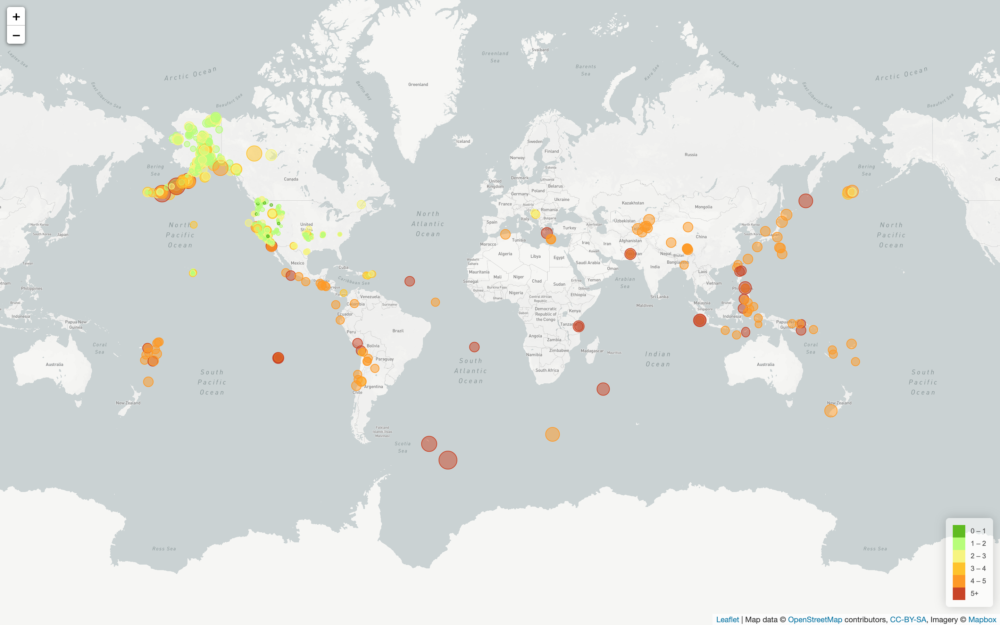

# Visualizing Data with Leaflet

This is a web tool to visualize earthquake data available from the United States Geological Survey (USGS). The USGS is responsible for providing scientific data about natural hazards, the health of our ecosystems and environment; and the impacts of climate and land-use change.

https://alapsraval.github.io/leaflet-data-visualization/

The following outlines the steps.

### Step 1 - Pull JSON data
   
   Pulled past 7 days' data from [USGS GeoJSON Feed](http://earthquake.usgs.gov/earthquakes/feed/v1.0/geojson.php) in JSON format for visualization.

- - -

### Step 2 - Import & Visualize the Data

   Created a map using Leaflet that plots all of the earthquakes from data set based on their longitude and latitude.

   * Data markers reflects the magnitude of the earthquake in their size and color. Earthquakes with higher magnitudes appear larger and darker in color.

   * Popups are used to provide additional information about the earthquake when a marker is clicked.

   * A legend provides context for map data.
   
   - - -
   
### Screenshot

